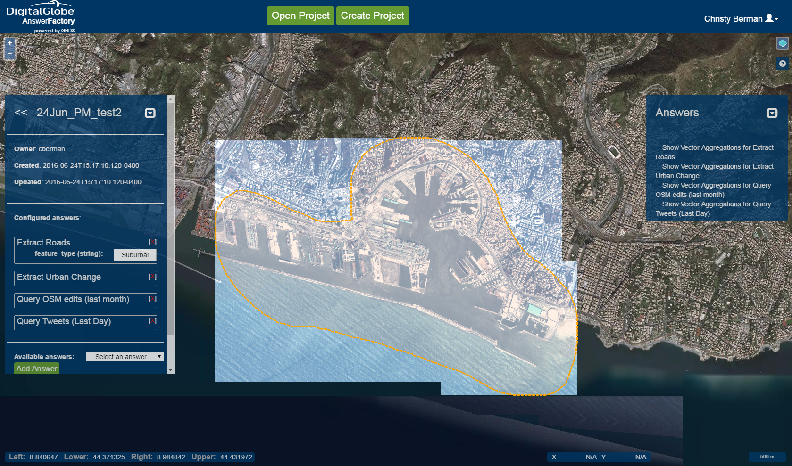
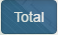
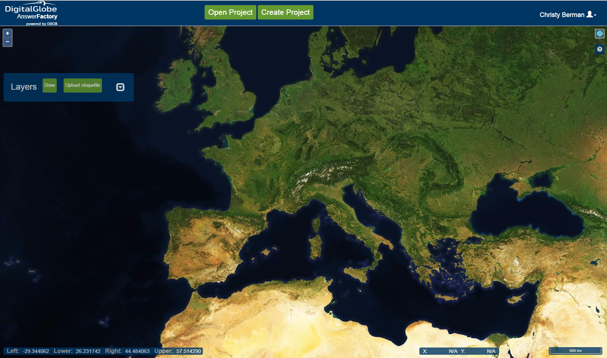
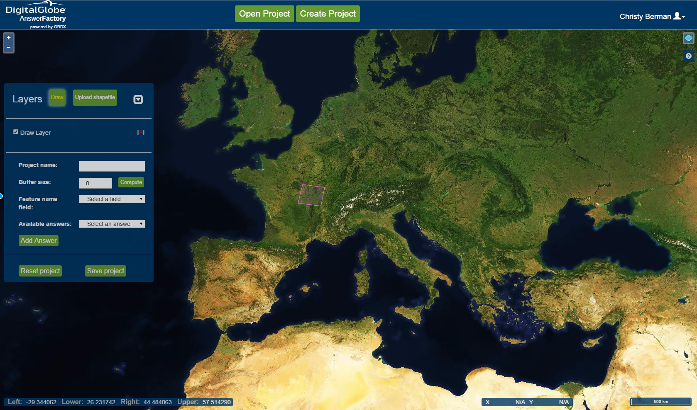

#DigitalGlobe GBDX AnswerFactory Help#
----------

#Contents#
[Logging In](#logging-in)  
[AnswerFactory Overview](#answerfactory-overview) 
[Open Project Page Layout](#open-project-page-layout)  
[View Project Page Layout](#view-project-page-layout) 
[Project Information](#project-information)  
[Answers](#answers)  
[Create Project Page Layout](#cp-page-layout)  
[Answer Types](#answer-types)  
  

#Logging In#
If you already have GBDX credentials, [log in to AnswerFactory](https://vector.geobigdata.io/answer-factory/login). If you do not have GBDX credentials, create an account with GBDX by using our [online registration tool](https://gbdx.geobigdata.io/account/self_registration/). Note that if your company already has an account, your account administrator will need to add you as a user to the account. If you are an account administrator, see the guide for [adding users to your account](http://gbdxdocs.digitalglobe.com/docs/video-lesson-how-to-add-users-to-your-account).  
Once you have reached the login screen, you may check the release notes by clicking on the What's New button, or you may simply enter your GBDX credentials and continue into AnswerFactory.  

   

#AnswerFactory Overview#
There are two main components in the AnswerFactory web application.   
___
Open Project - From the Open Project page, you can find previously created projects and view the answer results or check on the progress of the answers being processed.
___
Create Project - From the Create Project page, you can target your area of interest and choose the answers you want to see for your aoi.
___
  
In both components, you will see some universal tools.   
___
 Click to switch to Viewing projects.
___
 Click to switch to Creating projects.
___
 Shows the user currently logged in. Click to see the menu options available to the user. There are currently two available options: View your **Account Usage** stats or **Log Out** of AnswerFactory.
___
 Click to zoom in or out on the map. The mouse wheel can also be used to zoom.
___
 Hover over icon to see the layer list. Layers may be toggled on and off, and basemap may be changed here. There are currently two possible basemaps.
___
 Click to reach the help pages.
___
  

##Open Project##
Upon login, you will first be directed to the Open Project page.

###Open Project Page Layout###

  
___
 Toggle on viewing solely projects you have created, or leave toggled off to view all projects created in your group account.
___
 Click to minimize the window. Click again to bring the window back to full view.
___
 Click to force refresh the project list manually. Project list automatically updates once a minute.
___
 Type text to dynamically filter project list by project name.
___
 There are several ways to move through the pages of the list of projects in your account. Click on the arrows to jump forward or back through pages. Click on the visible numbers to jump to that page. Click on the dropdown to select any specific page to jump to.
___
  
To get started, find the project you would like to view and click on it in the project listing. This will drill down to the View Project level.
  

###View Project Page Layout###
Once you have entered your desired project, you will notice a change in the accessible functionality on the page. The map will automatically snap to the project aoi, and the IDAHO imagery that encompasses the aoi will be overlaid on top of the basemap. IDAHO imagery may be toggled off from the Legend.
 

  

####Project Information####

 
Project window lists the information for the selected project, including the answers that are currently associated with the project. You may add and remove answers from the project from this window.
___
 Click to return to the list of projects.
___
 Click to minimize the window. Click again to bring the window back to full view.
___
 Click to remove an answer from the project. *Note: you must click the Update button to update the project after altering it.*
___
**Available answers** - Dropdown holds the list of answers that may be added to the project. More than one answer may be added to a single project. For a list of possible answers and their descriptions, [go here](#answer-types).
___
 Click to add the selected answer to the project. Answers added to the project will appear on the right of the screen.
___
 Click to delete project from AnswerFactory.
___
 Click to save any changes made to the project.
___
 

####Answers####

 
The answer results are displayed here. If an answer is still processing, it will display as "Currently running..." Any completed answers will display as "Show..." To view a completed answer, click on it.
 

 
A table will appear to display the results. Each row represents an aoi. Clicking on a cell in the table will query the results to display on the map.
 

 
You can hover over vectors on the map to view metadata.
 
___
 When the results have different types, the various types display in the table. Click on a specific type to see only those results in the table, or click on total to see all of them.
___
 Click on column visibility to display the column options, and click on the options to turn them on or off.
___
 Click to copy table row(s) to clipboard.
___
 Click to print table.
___
 Click to save table in CSV format.
___
 Click to save table in PDF format.
___
 Click the dropdown to select the number of rows visible in the table at a time.
___
 Type to dynamically search the table when looking for a specific aoi.
___
 Click to display all the results for the given answer for the project over all of the aois.
___
 Click on the arrows to move between pages, or click on a specific page number to jump to the page.
___
  

##Create Project##
###Create Project Page Layout###

  
___
 Click to minimize the window. Click again to bring the window back to full view.
___
 Click to open your computer directory to upload a **zipped** shapefile (including all necessary components of .dbf, .prj, .shp, and .shx); this shapefile will serve as your aoi, and the map will automatically snap to the shapefile once upload is complete. Aoi(s) display in *pink*.
___
 Click to activate draw capability. Single click on map to drop the vertices of your aoi, and double-click to complete an aoi. Draw remains active, and you may draw any number of aois. Once you have completed drawing aois, click Draw button again to deactivate continued drawing capability. Aoi(s) display in *pink*.
___
 
Once an aoi is added or created, more functionality is exposed.  

  
___
**Project name** - Text field to enter a name for your project.
___
**Buffer size** - Text field to enter a value for a buffer around your aoi(s), in meters.
___
 Click to compute and add the buffer surrounding the aoi(s). The buffer will display in *orange*.
___
**Feature name field** - Dropdown is *only populated with uploaded aois*. Select the field that aois will be grouped by.
___
**Available answers** - Dropdown holds the list of answers that may be added to the project. More than one answer may be added to a single project. For a list of possible answers and their descriptions, [go here](#answer-types).
___
 Click to add the selected answer to the project. Answers added to the project will appear on the right of the screen.
___
 Click to clear all layers and answers to start over from scratch.
___
 Click to save the project once you have set all of your specifications.
___
  

##Answer Types##
The following is a list of possible answers that you may add to projects.
___
**Extract Aircrafts** - Runs an algorithm over a raster acquisition to identify aircrafts in the image and generate vectors with information on and to notate where the aircrafts are. There are three subtypes of aircraft currently being detected: Airliner, Fighter, and Helicopter. To view a slide describing the recipe for the answer, [click here](../images/Answer%20Definitions/Aircrafts.JPG). To view a demo of the answer, [click here](https://digitalglobe.wistia.com/medias/bi50oss7bz).
___
**Extract Aircrafts Change** - Runs Extract Aircrafts algorithm over multiple time series raster acquisitions and then compares the resulting vector outputs, displaying the difference.
___
**Extract Built-Up Areas** - Runs an algorithm over a raster acquisition to identify areas with man-made structures in the image and generate vectors with information on and to notate where the structures are. Note that discovering built-up areas is not synonymous with extracting individual buildings; an entire city may generate a single vector as a "built-up area." To view a slide describing the recipe for the answer, [click here](../images/Answer%20Definitions/BuiltUp_Areas.jpg). To view a demo of the answer, [click here](https://digitalglobe.wistia.com/medias/48718t7mal).
___
**Extract Built-Up Areas Change** - Runs Extract Built-Up Areas algorithm over multiple time series raster acquisitions and then compares the resulting vector outputs, displaying the difference.
___
**Extract Foliage** - Runs an algorithm over a raster acquisition to identify foliage in the image and generate vectors with information on and to notate where the foliage is. To view a slide describing the recipe for the answer, [click here](../images/Answer%20Definitions/Foliage1.jpg). To view a demo of the answer, [click here](https://digitalglobe.wistia.com/medias/vvkyb4a4jn).
___
**Extract LULC** - Standing for Land Use Land Cover, this runs an algorithm over a raster acquisition to identify various LULC types, such as Barren Soil, in the image and generate vectors with information on and to notate where the various types of LULC are. To view a slide describing the recipe for the answer, [click here](../images/Answer%20Definitions/LULC.JPG).
___
**Extract LULC Change** - Runs Extract LULC algorithm over multiple time series raster acquisitions and then compares the resulting vector outputs, displaying the difference.
___
**Extract Oilfields** - Runs an algorithm over a raster acquisition to identify oilfields in the image and generate vectors with information on and to notate where the oilfields are. To view a slide describing the recipe for the answer, [click here](../images/Answer%20Definitions/OilFields.JPG). 
___
**Extract Rivers** - Runs an algorithm over a raster acquisition to identify rivers in the image and generate vectors with information on and to notate where the rivers are. To view a slide describing the recipe for the answer, [click here](../images/Answer%20Definitions/Rivers.JPG). 
___
**Extract Roads** - Runs an algorithm over a raster acquisition to identify roads in the image and generate vectors with information on and to notate where the roads are. There are three subtypes of aircraft the user may detect on: Dirt Urban, Suburban, and Trails. To view a slide describing the recipe for the answer, [click here](../images/Answer%20Definitions/Roads.JPG). To view a demo of the answer, [click here](https://digitalglobe.wistia.com/medias/1lmngax11l).
___
**Extract Soil** - Runs an algorithm over a raster acquisition to identify areas with bare soil exposed in the image and generate vectors with information on and to notate where the bare areas are. To view a slide describing the recipe for the answer, [click here](../images/Answer%20Definitions/Soils.jpg).
___
**Extract Soil Change** - Runs Extract Soil algorithm over multiple time series raster acquisitions and then compares the resulting vector outputs, displaying the difference.
___
**Extract Urban Change** - Runs an algorithm over a set of raster acquisitions for change detection, to identify changes between the images and generate vectors with information on and to notate where the changes are. To view a slide describing the recipe for the answer, [click here](../images/Answer%20Definitions/ChangeDetection.JPG). To view a demo of the answer, [click here](https://digitalglobe.wistia.com/medias/mga2l31emk).
___
**Extract Urban Change Over Time** - Runs an algorithm over several sets of raster acquisitions for change detection, to identify changes between grouped images (eg, comparing images A/B, B/C, C/D) and generate vectors with information on and to notate where the changes are. To view a slide describing the recipe for the answer, [click here](../images/Answer%20Definitions/ChangeDetection.JPG). To view a demo of the answer, [click here](https://digitalglobe.wistia.com/medias/mga2l31emk).
___
**Extract Vegetation** - Runs an algorithm over a raster acquisition to identify areas with vegetation in the image and generate vectors with information on and to notate where the vegetation is. "Vegetation" in this case is defined as any type of flora with healthy chlorophyll content. Note that discovering vegetation is not synonymous with extracting individual plants; an entire forest may generate a single vector as vegetation. To view a slide describing the recipe for the answer, [click here](../images/Answer%20Definitions/Vegetation.jpg). To view a demo of the answer, [click here](https://digitalglobe.wistia.com/medias/p88g3k6yre).
___
**Extract Vegetation Change** - Runs Extract Vegetation algorithm over multiple time series raster acquisitions and then compares the resulting vector outputs, displaying the difference. To view a demo of the answer, [click here](https://digitalglobe.wistia.com/medias/p88g3k6yre).
___
**Extract Water** - Runs an algorithm over a raster acquisition to identify areas with water in the image and generate vectors with information on and to notate where the water is. To view a slide describing the recipe for the answer, [click here](../images/Answer%20Definitions/Water.jpg).
___
**Extract Water Change** - Runs Extract Water algorithm over multiple time series raster acquisitions and then compares the resulting vector outputs, displaying the difference.
